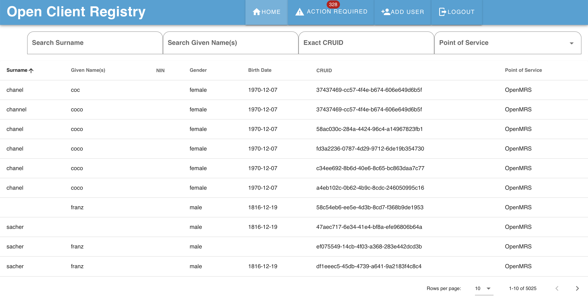
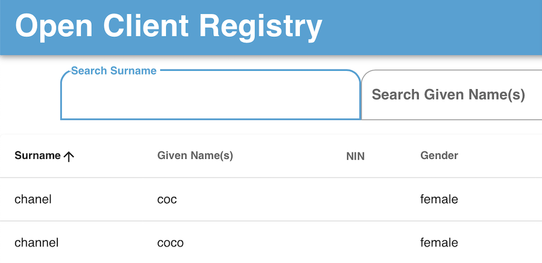
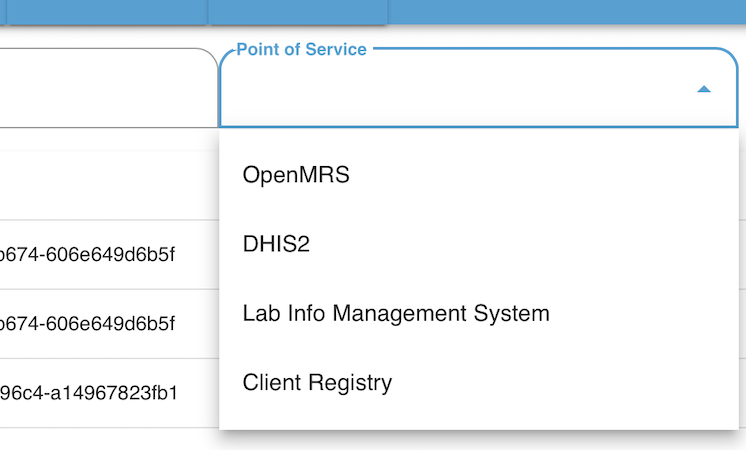
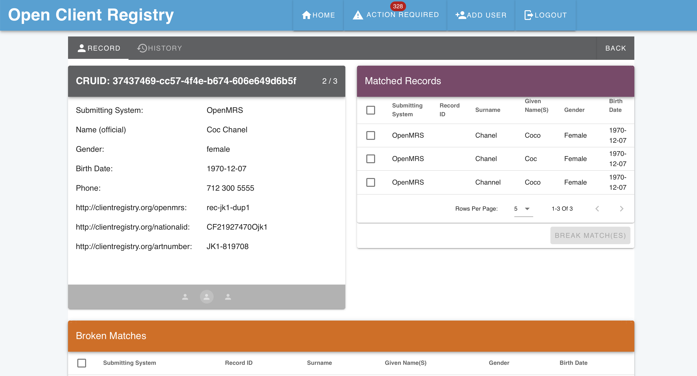
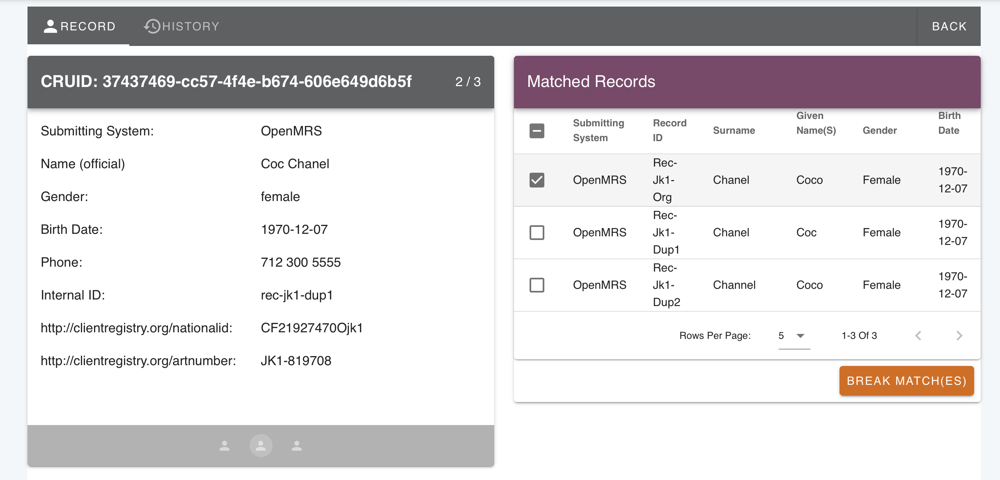
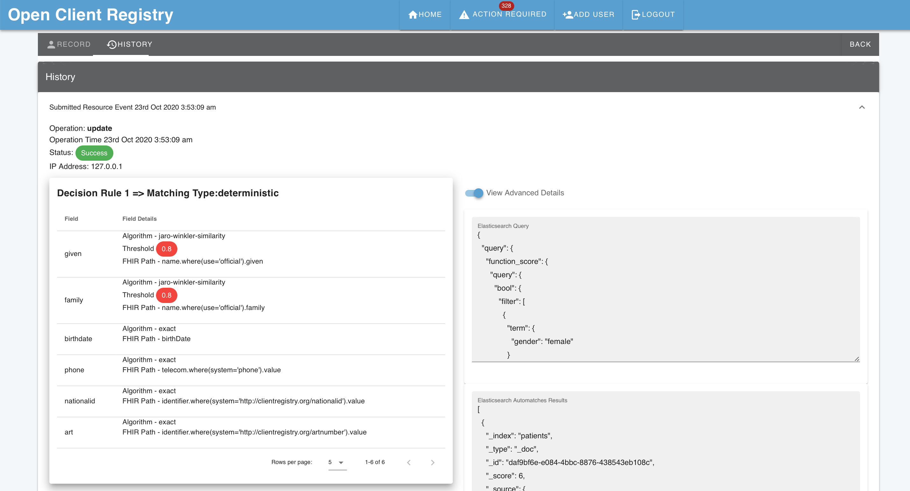
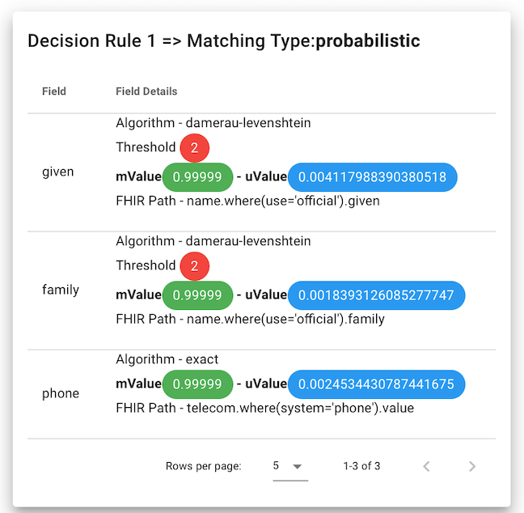
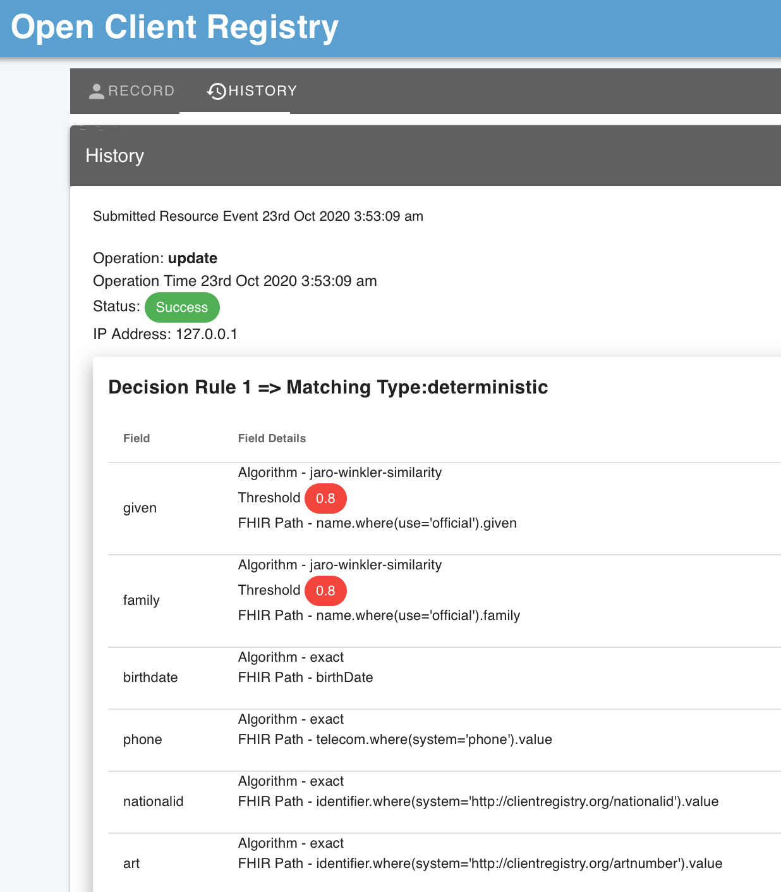
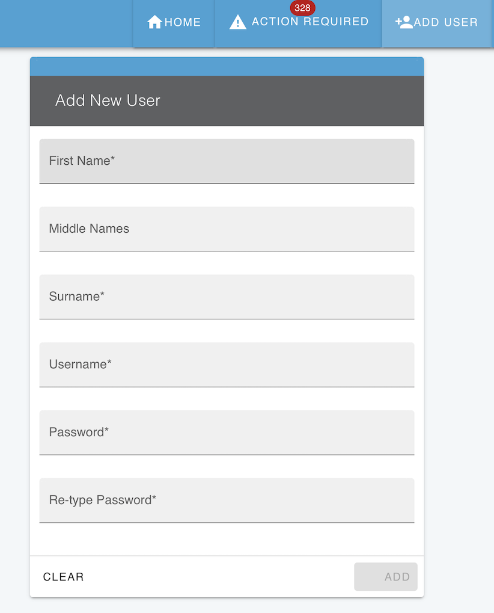

# UI -- Basics

!!! caution
    You may not have access to the UI, and that's a good thing. The UI allows users to be able to view any break any match, which includes viewing demographic data from submitting systems. It should be secure and only authorized users must be able to access it.

The OpenCR User Interface is a key way to monitor the operation of OpenCR. With it, you can:

* Verify FHIR messages are being processed correctly from submitting systems
* Validate matching is working as expected
* Perform deep inspection before putting it into production
* View matches, break matches, revert broken matches
* Conduct human adjudication to correct matches and create new ones.

## Login

User must be added to the CRUX to be able to login.

## Landing Page

On landing inside CRUX, it display the records submitted in a row. These are individual records for POS that submit them.

It is easy to search for records.

In the below example, there are two records submitted that share the same CRUID.

Searches can be restricted to specific points-of-service:

## Record

On clicking on an single record, a great deal of information is revealed.

* On the top right: All of the fields stored in the system
* On the top left: Matched records to the current one being viewed.
* Middle of the page: Broken matches, if they exist for the record.
* Bottom of the page: A history of all events affected the record, including creation, modification, and the decision rules used to make the matches.

## Matched Records and Break Match

Matched records are listed in a compact table with links to other record.

There is also an option to break one or all matches.

### Break and Revert Matches

A match can be broken. When a match is broken, the patient record is no longer linked to it, therefore its CRUID changes.

Once a match is broken, it may be reverted, meaning that the match can be reinstated.

## History

The history card shows the set of decision rules and overall submission information about each history event. All events include any decision rules that were used to make those matches and the specific Opensearch/ElasticSearch query.

Decision rules include the overall rule to evaluate the chain of decision rules, which is either probabilistic or deterministic. Then the card shows each decision rule and its configuration. This card helps understand how a decision was made and is critical for evaluation purposes.

The history card also includes when the event occurred, the status, and the IP address of the submitting system. (The address 127.0.0.1 in the example means within the same computer, not from the network, and is for example purposes only.)

## Add User

There is a simple add user feature in the main menu for administrators.

